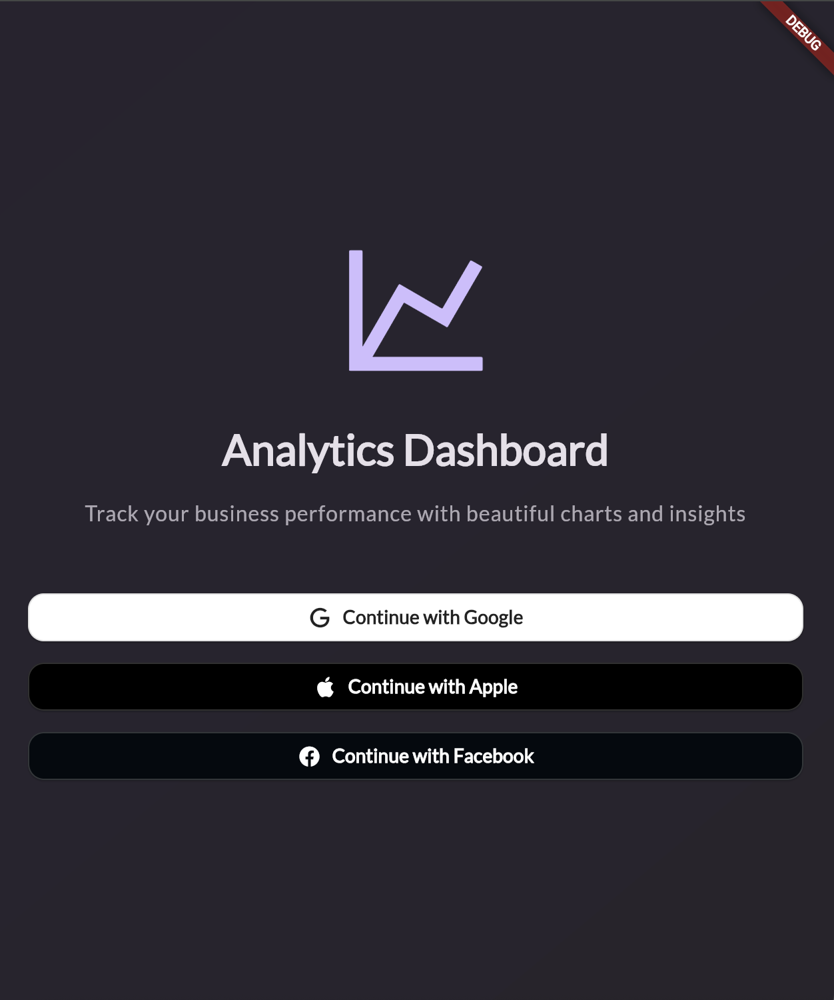
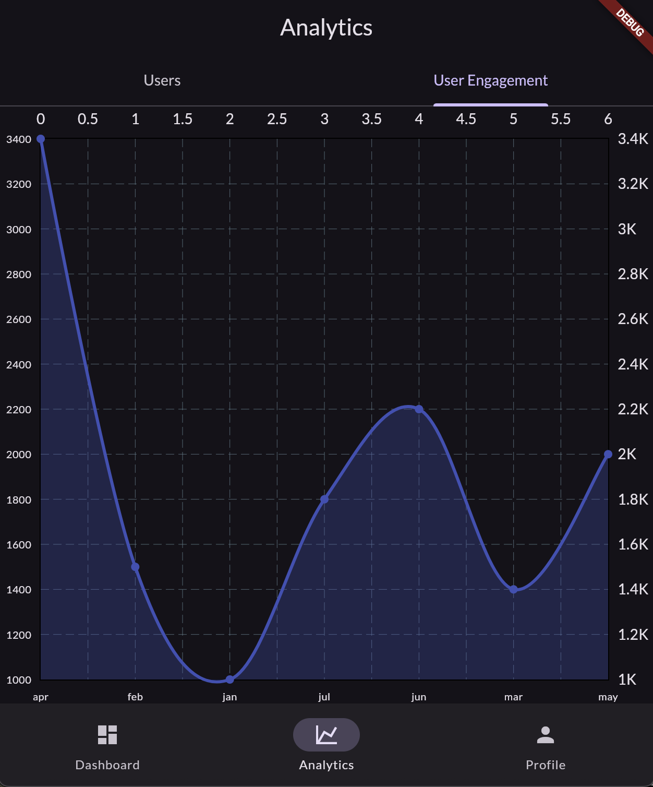
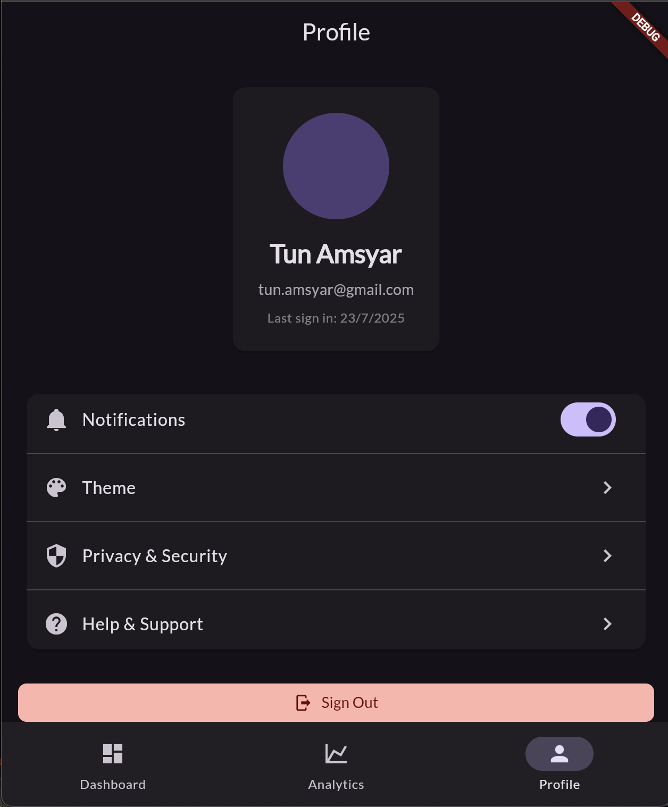
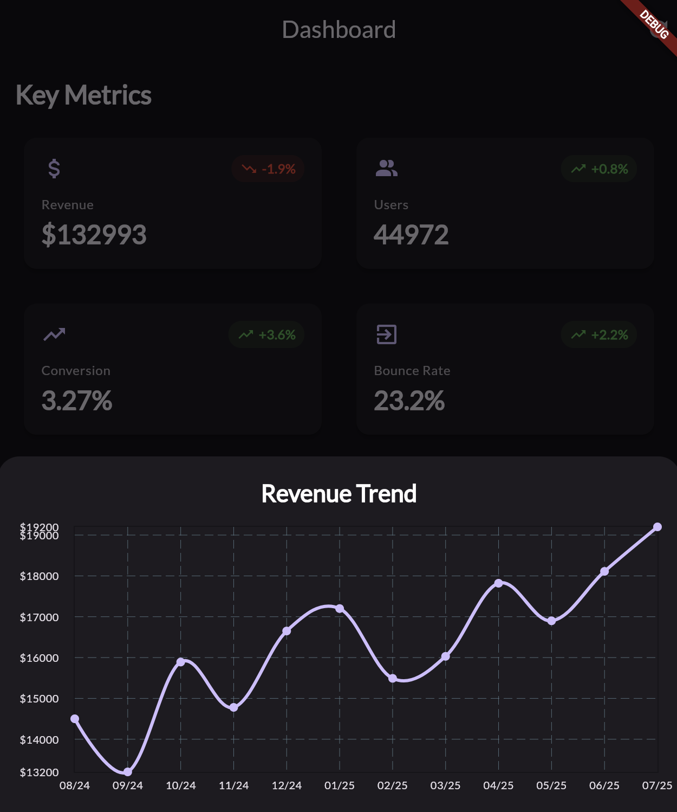

# 📊 Flutter Analytics App

This Flutter app visualizes user analytics data with a set of interactive charts and includes Firebase authentication. The data is sourced from Firestore and displayed in a clean tabbed layout.

---

## 🚀 Features

### 📈 Charts

- **Users Bar Chart** – shows the number of users per segment/category.
- **User Engagement Chart (Line Chart)** – displays monthly engagement trends.
- **Conversion Pie Chart** – visual breakdown of user conversions.

### 🧭 Navigation

- **Analytics Tab** – a tab-based UI for toggling between user and engagement analytics.
- **Profile Tab** - a tab for signed up user
- **Dashboard Tab** - a tab for multiple data summary

### 🔒 Authentication

- ✅ **Google Sign-In** – working and integrated with Firebase.
- 🚫 **Apple ID Sign-In** – currently stubbed (non-functional).
- ❓ **Facebook Sign-In** – implemented but not fully tested.

### 🔥 Firebase Integration

- **Firestore** – used as the main data source for all analytics.
- **Firebase Auth** – handles login and session management.

---

## 🖼️ Screenshots

### 🔐 Login Screen


### 📊 Analytics Tab


### 🧑‍💻 Profile Tab


### 📉 Small Charts


---

## 🛠️ Getting Started

1. Clone this repo
2. Run `flutter pub get`
3. Make sure Firebase is configured for iOS and Android
4. Launch on a simulator or device

```bash
flutter run
```

## 📦 Dependencies
```
flutter

firebase_core

firebase_auth

cloud_firestore

google_sign_in

fl_chart
```

## 🧪 Status
### Feature	Status

| Feature              | Status       |
| -------------------- | ------------ |
| Google Sign-In       | ✅ Working    |
| Apple ID Sign-In     | 🚫 Stubbed   |
| Facebook Sign-In     | ❓ Not tested |
| Charts UI            | ✅ Complete   |
| Firebase Integration | ✅ Complete   |


## 📌 Notes
- Apple ID sign-in is stubbed for now due to missing entitlements.
- Attempted to run on ios but could not get to work
- Refresh button on top right of dashboard randomizes numbers of the metric cards
